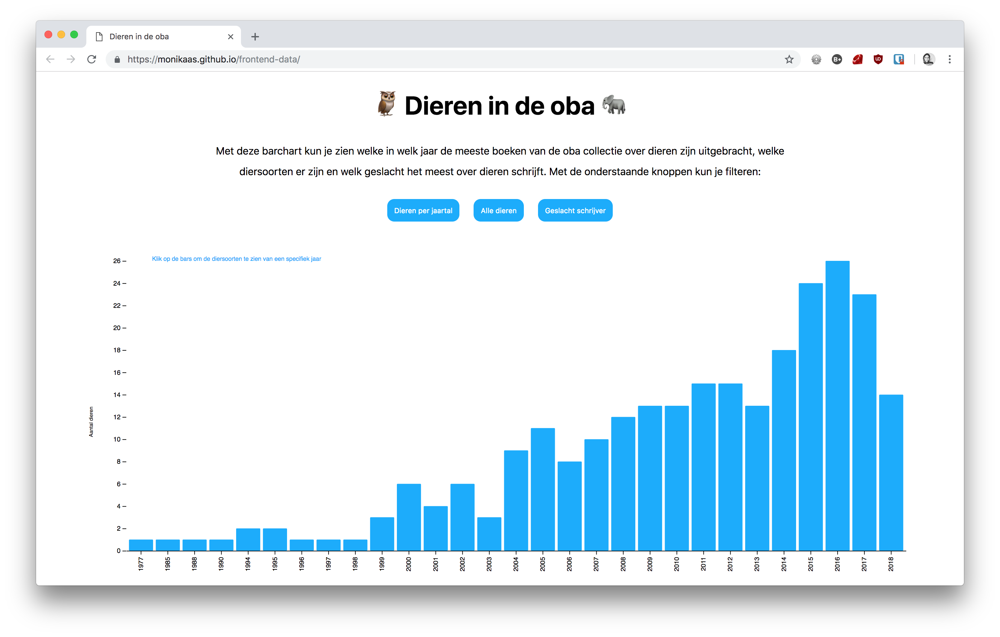
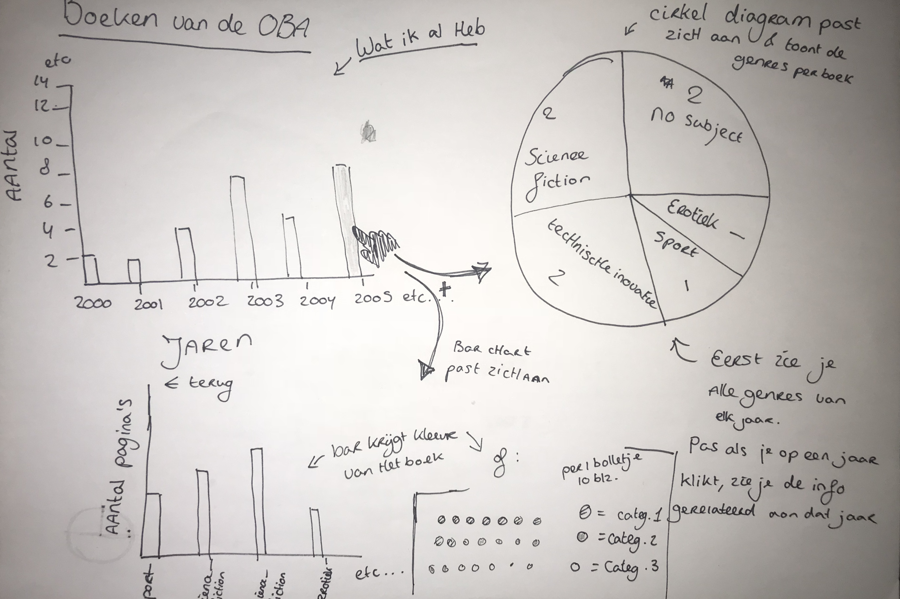
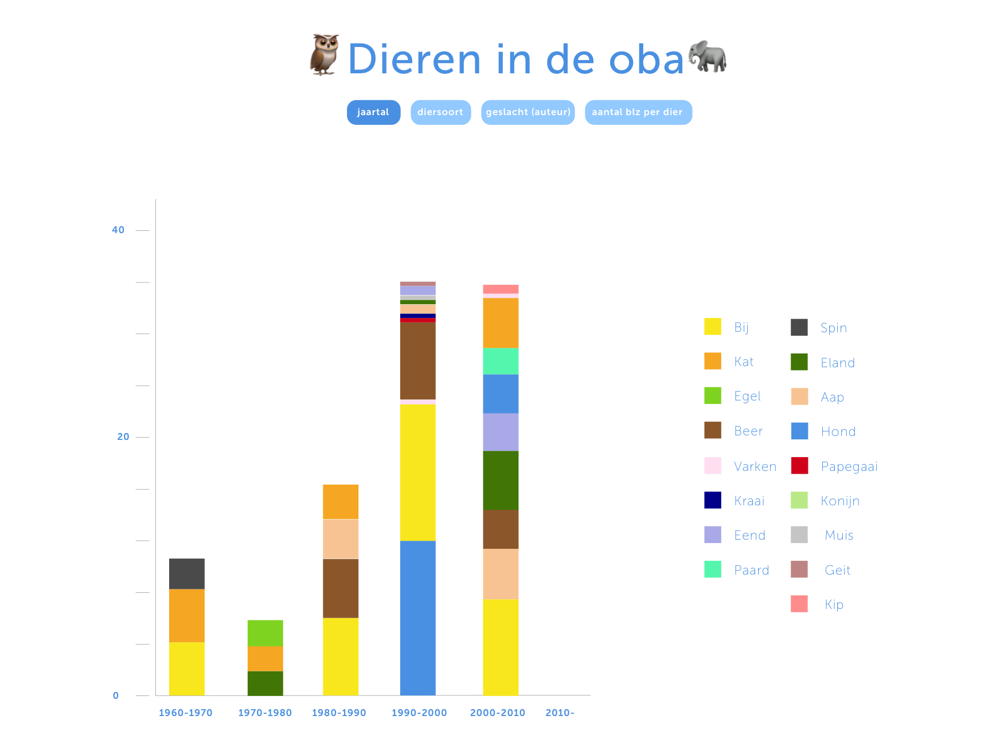
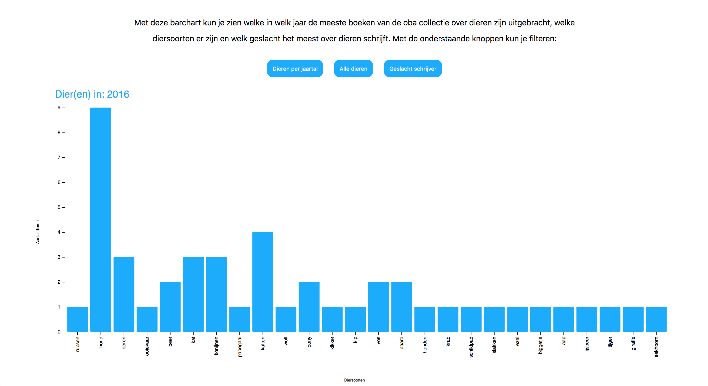

# Frontend-data 🤖

Voor het vak frontend-data moeten wij een interactieve datavisualisatie in d3 maken met behulp van de oba api.
Ik heb een visualisatie gemaakt over de dieren die voorkomen in de boeken van de oba.



# Install 🤖

```
Stap 1. git clone https://github.com/MonikaaS/frontend-data

Stap 2. Installeer een server, ik heb bij vscode een plugin gebruikt die LiveServer heet.
Maar je kan ook een package gebruiken van npm: https://www.npmjs.com/package/http-server

stap 3. cd frontend-data

profit


```

# Data 💾

De data die ik heb gebruikt:

- [De Dataset](https://github.com/MonikaaS/frontend-data/blob/master/data.json)[van Wouter Lem](https://github.com/maanlamp), die hij gedeeld heeft in de slack.
- [Mijn eigen samengestelde lijst van dieren](https://github.com/MonikaaS/frontend-data/blob/master/animals.js)

Deze dataset van Wouter bevat niet alle boeken van de oba. In de dataset zitten zo'n 4900 boeken, waarvan ik alle dieren eruit heb gefilterd. Waardoor er ongeveer nog 400 boeken met dieren zijn overgebleven.

Het linken van de twee datasets:
Om de dieren uit de boeken te halen heb ik een lijst gemaakt van dieren en deze in een apart bestand gezet. Ik ben vervolgens de dieren uit de lijst en summary gaan vergelijken. En als een dier overeenkomt, haalt hij hem uit de lijst en stopt het in een object.

```
let dataStore = data.map(books => {

            var animalsInSummary = animalsArray.filter(val => books.summary.includes(" " + val + " ")); //haal de dieren uit de summary

            return {
                year: books.publication.year,
                gender: (books.author.gender === null) ? "geslacht onbekend" : books.author.gender,
                pages: books.characteristics.pages,
                animals: (animalsInSummary.length == 0) ? undefined : animalsInSummary[0], //get only the first animal, because if a summary has multiple animals, it will return an array within an array (don't know how to fix it)
                titel: books.title
            }
        })
```

Vervolgens ben ik doormiddel van `d3.nest` verschillende soorten datasets gaan maken om de dieren per jaar op te halen, de unieke dieren en het geslacht van de schrijver.

Ik wilde nog het gemiddelde aantal `bladzijdes` per diersoort visualiseren, maar helaas ben ik hier niet meer aan toe gekomen.

De `titel` heb ik opgehaald, omdat ik in het begin last had van "dieren", die uit woorden gehaald werden. Zoals Engeland werd dan Eland, probeer, maakte hij beer van en zo waren er wel meer woorden.. Ik gebruikte de titel, zodat ik makkelijk kon opzoeken of het dier ook echt in de summary zat. Met code heb ik het mooi kunnen oplossen door `books.summary.includes(val)` te veranderen naar `books.summary.includes(" " + val + " ")` de lege strings voor en na mijn value, zorgen er voor dat hij het hele woord pakt en niet alleen de letters in een woord. Ik heb ook woorden zoals "bij" weggelaten, omdat hier niet echt op te controleren valt dmv code.

# Schetsen ✏️

In het begin had ik een hele erge basic schets gemaakt over de genres per jaar


Om het specifieker te maken, ben ik mij gaan focussen op dieren in boeken en ben dan ook gaan proberen dit er uit te halen. Toen ik de data opgehaald had, had ik aan de hand van de data een visualisatie er van gemaakt:



Al gauw kwam ik er achter dat een stacked barchart niet zo handig is, want ik heb 73 unieke dieren. Hierdoor zou je een super lange legenda krijgen, waardoor je het overzicht gewoon kwijt raakt. Vandaar dat niet alle 73 dieren in mijn wireframe staan 💩 Ik heb daarom besloten om een gewone barchart gaan maken, met daarop de interactie dat je op elke individuele bar kan klikken. Zodat je de specifieke dieren per jaar kan zien.

# Visualisatie 📊

Ik wilde graag de gebruiker zelf laten zoeken, naar interessante patronen in de data. En heb daarom knoppen toegevoegd om door de data te sorteren. Ook kan je op de bars klikken om bijvoorbeeld in een specifiek jaar de dieren te bekijken. Ik had nog graag een gemiddelde-aantal-bladzijde's-per-dier-knop willen toevoegen, maar daar was geen tijd meer voor.

[Bekijk het prototype hier](https://monikaas.github.io/frontend-data/)

**Interacties:**

Mijn code kan je vinden in de `index.js`
Mijn grootste frustratie met d3 was, het toevoegen van interactie. Ik begreep namelijk niet meteen hoe enter(), update en exit() werkte. Dus had voor elke dataset een nieuwe functie gemaakt, maar wilde dit graag allemaal in 1 functie hebben.

Dit heb ik opgelost door:

Mijn bar chart wordt gerendert door de `function animalsChart(dataSet)`. Wanneer ik de functie aanroep zet ik in de parameters de dataset die ik wil bij het event wil inladen.

In deze `animalsChart` functie zit een ook een `.on("click")` vast aan mijn bars. Deze onclick functie, zorgt er voor dat je de bar kan selecteren om de specifieke data te renderen die in die key zit van de bar waar je op klikt.



Voor de rest worden de buttons beneden aan geroepen, met daarop dan de eventListeners. Die vervolgens de chart inlaadt met de juiste data:

```
 d3.select("#bt1").on("click", function () {
            animalsChart(animalsPerYear);
        });

        d3.select("#bt2").on("click", function () {
            animalsChart(uniqueAnimals);
        });

        d3.select("#bt3").on("click", function () {
            animalsChart(genderWriters);
        });
```

# Reflectie 💖

Ik vind d3 erg lastig en heb ook erg veel frustraties gehad de afgelopen weken. De leercurve van d3 is erg hoog en veel concepten van d3 voelen erg abstract aan. Maar als het eenmaal lukt, vind ik het zelf heel erg leuk om er mee te werken. Ik merk dat ik nog meer zou willen oefenen met d3. Ik weet namelijk nu hoe een bar chart gemaakt wordt en zou graag mijzelf wat meer willen uitdagen, door bijvoorbeeld een kaart te gebruiken om een visualisatie te tonen.

Ik vond het erg leuk om de interactie werkend te krijgen. Ben daarom ook erg trots dat het mij gelukt is om de interactie voor elkaar te krijgen dat je op een bar kan klikken. En daar dan van weer de waardes er uit terug krijgen.

Waar ik nog heel erg mee struggle is het opzetten van mijn datastructuur. Ik vind het nog erg lastig te zien, wat de beste structuur is voor wat je wilt visualiseren, hier heb ik dan ook weer veel tijd in gestopt.

Kwa codeer skills meer ik dat ik tijdens dit blok veel gegroeid ben. Als ik mijzelf vergelijk met een aantal weken terug toen we nog met de frameworks bezig waren. Merk ik nu dat ik sneller zelf dingen durf te doen, te proberen, fouten te maken en zelf op te lossen.

# Credits 🗝

- Ik heb voornamelijk het voorbeeld van Mike Bostock gebruikt om een bar chart te maken: [Mike Bostocks bar chart](https://beta.observablehq.com/@mbostock/d3-bar-chart)
- voor mijn interactie heb ik vooral naar dit voorbeed gekeken en geexpirimenteerd van: [Chi-loong's interactie voorbeeld](https://bl.ocks.org/Chi-Loong/e3389dfb6873c85caf445f0faba52ec4)
- En [Folkert-Jan](https://github.com/FJvdPol) die mij geholpen heeft met het uitleggen van wat ik fout deed bij mijn `.onclick` functie.

# To Do 💡

[Check my To Do list here](https://github.com/MonikaaS/frontend-data/issues)
